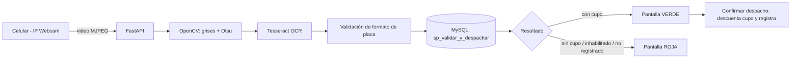

# ⛽ Control Automatizado de Combustible Subvencionado (ANPR)

### 🌐 Entorno web funcional

> Estación de Servicio **Jacha Inti S.R.L.** · La Paz, Bolivia
> Sistema que identifica vehículos por su placa y valida su cupo diario antes de habilitar el despacho.

El sistema está desplegado en línea y se puede probar ahora mismo:

| Qué | Link | Acceso |
|---|---|---|
| **Playero (surtidor)** | https://control-combustible-anpr-production.up.railway.app/ | `playero1` / `Playero#2026` |
| **Admin (dashboard)** | https://control-combustible-anpr-production.up.railway.app/static/dashboard.html | `admin` / `Admin#2026` |
| **Estado del sistema** | https://control-combustible-anpr-production.up.railway.app/health | sin login |
| **Documentación API** | https://control-combustible-anpr-production.up.railway.app/docs | sin login |

**Usuarios de PRUEBA** :

| Usuario | Contraseña | Rol |
|---|---|---|
| `admin` | `Admin#2026` | ADMIN |
| `playero1` | `Playero#2026` | PLAYERO |

**Placas de prueba** (escríbelas en el campo "Consultar" de la pantalla del playero):

| Placa | Resultado esperado |
|---|---|
| `1234ABC` | 🟢 Habilitada, con cupo |
| `5678DEF` | 🟢 Habilitada, con cupo parcial (10 L) |
| `9012GHI` | 🔴 Cupo agotado |
| `3456JKL` | 🔴 Vehículo inhabilitado |
| `0000XXX` | 🔴 Placa no registrada |

> ℹ️ **Nota:** en el entorno en línea la cámara del celular no está disponible (la cámara vive en la red local de la estación), por lo que el botón *Escanear placa* mostrará "sin señal". Para la demostración en línea usa el campo de **placa manual**. La lectura automática con cámara funciona al ejecutar el sistema en la red local (ver [Instalación local](#-instalación-local)).

---

## 👥 Equipo de desarrollo

**Grupo: Error 505**

| # | Integrante |
|---|---|
| 1 | Fernando Castro Vargas |
| 2 | Juan Carlos Chavez Machaca |
| 3 | Kevin Jheferson Jiménez Quisbert |
| 4 | Erick Ivan Luna Tarqui |
| 5 | Juan Antonio Ramos |

**Materias:** Ingeniería de Sistemas I · Ingeniería de Redes · Ingeniería de Software

---

## 📌 Descripción del proyecto

En las estaciones de servicio, el combustible subvencionado (Gasolina Especial y Gasolina Especial +) se controla de forma manual, lo que permite que un mismo vehículo cargue más de lo permitido en el día.

Este sistema automatiza el control: una cámara lee la **placa** del vehículo, el sistema consulta en la base de datos si está **habilitado** y cuánto **cupo diario** le queda, y la pantalla del playero muestra de inmediato:

- 🟢 **PANTALLA VERDE:** vehículo habilitado y con cupo. Se muestran propietario, combustible y litros disponibles, y el playero confirma los litros despachados.
- 🔴 **PANTALLA ROJA:** vehículo bloqueado (cupo agotado, inhabilitado o no registrado), con el motivo del bloqueo.

Cada intento, aprobado o rechazado, queda registrado como auditoría. El encargado puede revisar el historial, ver métricas del día y gestionar los vehículos autorizados desde un panel de administración.

---

## 🎯 Objetivos

**Objetivo general:** automatizar el control del despacho de combustible subvencionado mediante el reconocimiento automático de placas (ANPR) y la validación de cupos en tiempo real.

**Objetivos específicos:**

- Reconocer la placa del vehículo con una **precisión meta ≥ 90%** (OpenCV + Otsu + Tesseract OCR).
- Validar el cupo en la base de datos en **menos de 3 segundos**.
- Mostrar al playero un resultado visual inmediato (verde / rojo).
- Registrar cada transacción para auditoría y reportes.
- Separar los accesos por rol (Playero y Administrador) con autenticación.

> Las metas de precisión y tiempo son objetivos de diseño del proyecto; la precisión real depende de las condiciones de captura (luz, ángulo y calidad de la placa).

---

## 🛠️ Herramientas y tecnologías

| Capa | Tecnología | Uso |
|---|---|---|
| Lenguaje | **Python 3.11** | Backend y visión artificial |
| Backend / API | **FastAPI + Uvicorn** | API REST, validaciones y autenticación |
| Visión artificial | **OpenCV** | Localización de la placa, escala de grises y binarización de **Otsu** |
| OCR | **Tesseract OCR** (`pytesseract`) | Lectura de los caracteres de la placa |
| Base de datos | **MySQL** (`mysql-connector-python`) | Datos relacionales, procedimientos almacenados y eventos |
| Captura de video | **IP Webcam** (app Android) | El celular funciona como cámara IP (MJPEG) |
| Frontend | **HTML + CSS + JavaScript** | Pantalla del playero y dashboard administrativo |
| Seguridad | **PBKDF2-SHA256** + tokens de sesión | Contraseñas con hash y acceso por roles |
| Despliegue | **Docker + Railway + GitHub** | Publicación en la nube con despliegue continuo |
| Entorno | **Visual Studio Code** | Desarrollo |

---

## 🧱 Estructura del sistema

### Arquitectura

Arquitectura **cliente-servidor** basada en una **API REST**. El backend en capas (rutas, esquemas, acceso a datos, motor OCR) atiende a interfaces web ligeras.



### Flujo de operación

1. El playero inicia sesión y abre la pantalla del surtidor con el video en vivo.
2. Pulsa **Escanear placa** (o escribe la placa a mano).
3. El motor ANPR localiza la placa, la binariza con Otsu y la lee con Tesseract.
4. La API consulta el estado y el cupo del vehículo en MySQL.
5. La pantalla muestra **verde** o **roja**.
6. Si es verde, el playero ingresa los litros y pulsa **Confirmar despacho**: el cupo se descuenta y la transacción queda registrada.
7. A medianoche, un evento programado de MySQL repone los cupos diarios.

### Estructura de carpetas

```
estacion-combustible/
├── Dockerfile              # Imagen para despliegue (Python + Tesseract)
├── requirements.txt        # Dependencias de Python
├── README.md
├── schema.sql              # BD: tablas, procedimientos, evento y datos de prueba
├── schema_usuarios.sql     # Tabla de usuarios y roles
├── config.py               # Lectura de variables de entorno
├── database.py             # Conexión MySQL, consultas y usuarios
├── ocr_engine.py           # OpenCV + Otsu + Tesseract + validación de placa
├── schemas.py              # Modelos Pydantic (entradas y salidas de la API)
├── main.py                 # API FastAPI: endpoints, roles y streaming
├── test_ocr.py             # Prueba del OCR con imágenes de capturas/
├── capturas/               # Fotos de placas para pruebas
└── static/
    ├── index.html          # Pantalla del playero (verde / roja)
    └── dashboard.html      # Panel de administración
```

### Base de datos

| Tabla / objeto | Descripción |
|---|---|
| `vehiculos` | Placa, propietario, CI, combustible, capacidad del tanque, cupo diario, cupo disponible y estado (`HABILITADO`, `INHABILITADO`, `CUPO_AGOTADO`) |
| `despachos` | Auditoría de cada transacción: placa, litros, fecha, surtidor, estado (`APROBADO`/`RECHAZADO`) y motivo |
| `lecturas_anpr` | Registro de cada lectura del OCR con su confianza (sirve para medir la precisión) |
| `usuarios` | Usuarios, rol (`ADMIN` / `PLAYERO`) y contraseña con hash |
| `sp_validar_y_despachar` | Procedimiento transaccional: valida, bloquea la fila, descuenta el cupo y registra |
| `sp_consultar_placa` | Consulta de cupo sin descontar |
| `ev_reiniciar_cupos_diarios` | Evento que repone los cupos a medianoche |

### Endpoints principales

| Método | Ruta | Rol | Descripción |
|---|---|---|---|
| `POST` | `/login` | — | Inicia sesión y devuelve token y rol |
| `POST` | `/validar` | Playero / Admin | Lee la placa (imagen, cámara o manual) y consulta el cupo |
| `POST` | `/despachar` | Playero / Admin | Descuenta litros y registra la transacción |
| `GET` | `/stream` | Playero / Admin | Video en vivo de la cámara |
| `GET` | `/admin/stats` | Admin | Métricas del día |
| `GET` | `/admin/despachos` | Admin | Historial con filtros (fecha, placa, surtidor, estado) |
| `GET` / `POST` | `/admin/vehiculos` | Admin | Listar, registrar o actualizar vehículos |
| `GET` | `/health` | — | Estado de la API, la base de datos y la cámara |

---

## 📖 Tutorial de uso

### Como Playero

1. Abre el link del **Playero** e ingresa con `playero1` / `Playero#2026`.
2. Apunta la cámara a la placa y pulsa **Escanear placa**. Sin cámara, escribe la placa en el campo de texto y pulsa **Consultar**.
3. Interpreta el resultado:
   - 🟢 **HABILITADO:** revisa propietario y litros disponibles, escribe los litros a despachar y pulsa **Confirmar despacho**.
   - 🔴 **BLOQUEADO:** no despaches; la pantalla indica el motivo.
4. Pulsa **Nueva lectura** (o espera 10 segundos) para atender al siguiente vehículo.

### Como Administrador

1. Abre el link del **Admin** e ingresa con `admin` / `Admin#2026`.
2. **Métricas:** litros despachados hoy y despachos aprobados y rechazados (se actualizan cada 15 segundos).
3. **Pestaña Despachos:** filtra el historial por fecha, placa, surtidor y estado.
4. **Pestaña Vehículos:** busca vehículos, pulsa **Nuevo vehículo** para registrarlo o **Editar** para cambiar sus datos, cupo o estado (`HABILITADO` / `INHABILITADO`).
5. Prueba el flujo completo: haz un despacho como playero y comprueba que aparece en el dashboard.

---

## 💻 Instalación local

**Requisitos:** Python 3.10+, MySQL, [Tesseract OCR](https://github.com/tesseract-ocr/tesseract) y (opcional) la app **IP Webcam** en un celular Android.

```bash
# 1. Clonar el repositorio
git clone https://github.com/JuanChavezDJ/estacion-combustible.git
cd estacion-combustible

# 2. Entorno virtual e instalación de dependencias
python -m venv venv
venv\Scripts\activate            # Linux/Mac: source venv/bin/activate
pip install -r requirements.txt

# 3. Base de datos (crea tablas, procedimientos y usuarios de prueba)
mysql -u root -p < schema.sql
mysql -u root -p < schema_usuarios.sql

# 4. Configurar el archivo .env (ver abajo) y ejecutar
uvicorn main:app --reload
```

**Variables de entorno (`.env`):**

```env
DB_HOST=localhost
DB_PORT=3306
DB_USER=root
DB_PASSWORD=tu_contraseña
DB_NAME=estacion_jacha_inti
TESSERACT_CMD=C:\Program Files\Tesseract-OCR\tesseract.exe   # en Linux: /usr/bin/tesseract
CAMARA_URL=http://IP_DEL_CELULAR:8080/video                  # app IP Webcam
```

**Links en local:**

| Qué | Link |
|---|---|
| Playero | http://127.0.0.1:8000/ |
| Admin | http://127.0.0.1:8000/static/dashboard.html |
| Estado | http://127.0.0.1:8000/health |
| Documentación API | http://127.0.0.1:8000/docs |

**Cámara:** en el celular abre *IP Webcam* → *Iniciar servidor* y copia la IP que muestra en `CAMARA_URL`. El celular y la PC deben estar en la misma red Wi-Fi.

**Probar solo el OCR:** copia fotos de placas en `capturas/` (nómbralas con la placa real, por ejemplo `1234ABC.jpg`) y ejecuta `python test_ocr.py`; el script calcula el porcentaje de aciertos.

---

## 🚀 Despliegue

El proyecto se despliega en **Railway** a partir de este repositorio de GitHub (cada `git push` a `main` genera un nuevo despliegue). Requiere un servicio **MySQL** en Railway y las variables `DB_HOST`, `DB_PORT`, `DB_USER`, `DB_PASSWORD`, `DB_NAME` y `TESSERACT_CMD=/usr/bin/tesseract`.

---

## ⚠️ Limitaciones conocidas

- La **precisión del OCR** debe validarse con fotos reales de placas bolivianas en distintas condiciones de luz y ángulo.
- La cámara solo es accesible en la **red local** donde está el celular; en la nube se usa la placa manual.
- Las **sesiones se guardan en memoria**: se pierden al reiniciar el servidor.
- No hay límite de intentos de login ni HTTPS en el entorno local.
- Los usuarios y contraseñas de prueba deben cambiarse antes de un uso real.

## 🔭 Mejoras futuras

- Detección automática del vehículo (lectura continua sin pulsar el botón).
- Entrenar o ajustar un modelo de detección de placas para mejorar la precisión.
- Reportes exportables (PDF/Excel) por rango de fechas.
- Límite de intentos de login, HTTPS y sesiones persistentes.
- Integración directa con la bomba del surtidor.
- Aplicación móvil para el playero.

---

<p align="center">Proyecto universitario · Grupo <b>Error 505</b> · Ingeniería de Sistemas I · Ingeniería de Redes · Ingeniería de Software</p>
